<div align="center">


<br><br>


<br>


</div>


## `01` Boot sequence

```java
package com.stark.industries.backend;

import com.stark.jarvis.annotation.EnableJarvis;
import org.springframework.boot.SpringApplication;
import org.springframework.boot.autoconfigure.SpringBootApplication;

@EnableJarvis
@SpringBootApplication
public class MarkLXXXVApplication {

    private static final String OPERADOR = "Kauã Santana Jerônimo";
    private static final String CARGO    = "Backend Developer";
    private static final int    REATOR   = 100; // %

    private final List<String> armadura = List.of(
        "Java", "Spring Boot", "Microsserviços",
        "REST APIs", "Docker", "Git",
        "SQL", "NoSQL", "Design Patterns"
    );

    public static void main(String[] args) {
        SpringApplication.run(MarkLXXXVApplication.class, args);

        System.out.println("Sometimes you gotta run before you can walk.");
        System.out.println(">> I am Iron Man.");
    }
}
```

> **JARVIS:** *Compilação concluída em 0.42s, senhor. Nenhum `NullPointerException` detectado — por enquanto.*

<br>

Desenvolvedor **backend** movido a **Java** e ao ecossistema **Spring**. Construo APIs que aguentam porrada.

- Arquitetura de **microsserviços**, **Spring Boot** e aplicações escaláveis
- Bancos **relacionais e não relacionais** — modelagem, query e performance
- **Design Patterns**, código limpo e versionamento levado a sério
- Containerização com **Docker** e rotina de estudo que nunca desliga


## `02` Armor loadout

<div align="center">



<br><br>


</div>


## `03` Suit diagnostics

<div align="center">


<br>


<br><br>


</div>


## `04` Arc reactor output

<div align="center">


</div>


## `05` Estabelecer comunicação

<div align="center">

<a href="https://www.linkedin.com/in/kau%C3%A3-santana-jer%C3%B4nimo-611a1a292/">
  
</a>
<a href="mailto:kaua.santanaj@gmail.com">
  
</a>
<a href="https://github.com/Kaua73-dev">
  
</a>

</div>

<br>

<details>
<summary><b>🔒 Protocolo Casa Segura — abrir por sua conta e risco</b></summary>

<br>

```java
try {
    deploy(sexta, 18, 00);
} catch (ProductionOnFireException e) {
    jarvis.acionarProtocoloCasaSegura();
    log.error("Eu avisei.", e);
} finally {
    git.revert(HEAD);
}
```

*"Às vezes você tem que correr antes de aprender a andar."* — e às vezes você tem que fazer rollback antes de aprender a testar.

</details>

<br>

<div align="center">


<sub><b>Java não é só linguagem. É armadura.</b></sub>

</div>