<div align="center">



<br><br>


<br>


</div>


## `01` Inicialização

```java
package dev.kaua.core.domain;

/**
 * A regra de negócio não conhece framework, banco nem HTTP.
 * Se precisa de mock para ser testada, foi modelada errado.
 */
public record Desenvolvedor(String nome, Nivel nivel, Set<Competencia> stack) {

    public Desenvolvedor {
        Objects.requireNonNull(nome, "nome é obrigatório");
        stack = Set.copyOf(stack);
    }

    public boolean atende(Demanda demanda) {
        return stack.containsAll(demanda.requisitos());
    }

    public Desenvolvedor aprende(Competencia nova) {
        var ampliada = new HashSet<>(stack);
        ampliada.add(nova);
        return new Desenvolvedor(nome, nivel, ampliada);
    }
}
```

Backend em **Java** e ecossistema **Spring**. Meu trabalho é fazer sistema que continua de pé depois que o tráfego chega.

- **Microsserviços** e **APIs REST** — contrato claro, falha isolada, deploy independente
- **TDD** — teste primeiro, e a suíte roda antes de eu abrir o PR
- **DDD** — domínio no centro, regra de negócio longe do controller
- **Clean Code** e **Design Patterns** — código que o próximo dev entende sem me chamar
- **SQL e NoSQL** — modelagem, índice e query que não degrada quando a tabela cresce
- **Docker** e **Git** — ambiente reproduzível, histórico legível
- **Node.js** quando o problema pede, sem trocar de religião por isso


## `02` Stack

<div align="center">



<br><br>


</div>


## `03` Telemetria

<div align="center">


<br>


<br><br>


</div>


## `04` Canal aberto

<div align="center">

<a href="https://www.linkedin.com/in/kau%C3%A3-santana-jer%C3%B4nimo-611a1a292/">
  
</a>
<a href="mailto:kaua.santanaj@gmail.com">
  
</a>
<a href="https://github.com/Kaua73-dev">
  
</a>

<br><br>


<sub>Aberto a oportunidades e a código que sobrevive ao próximo sprint.</sub>

</div>
